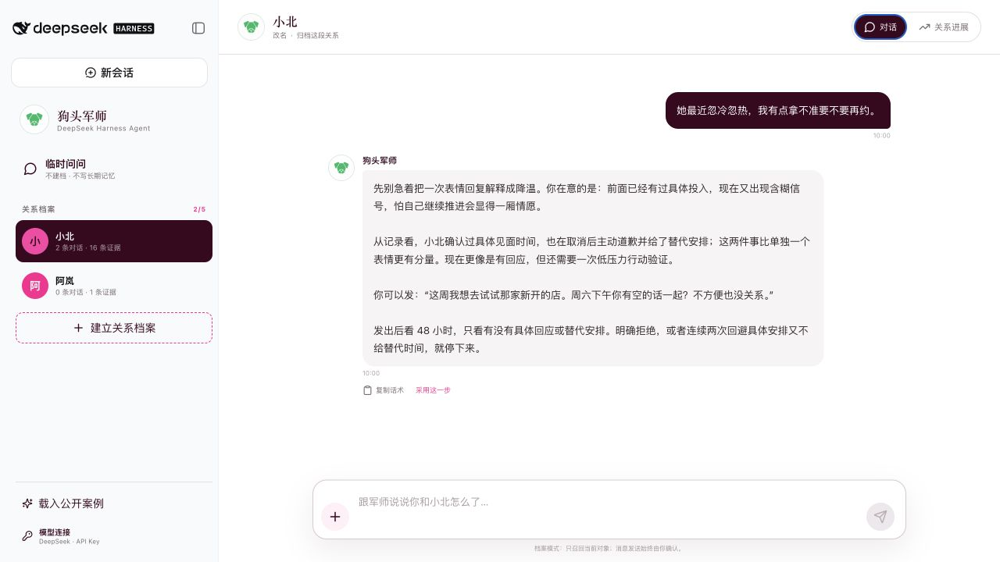
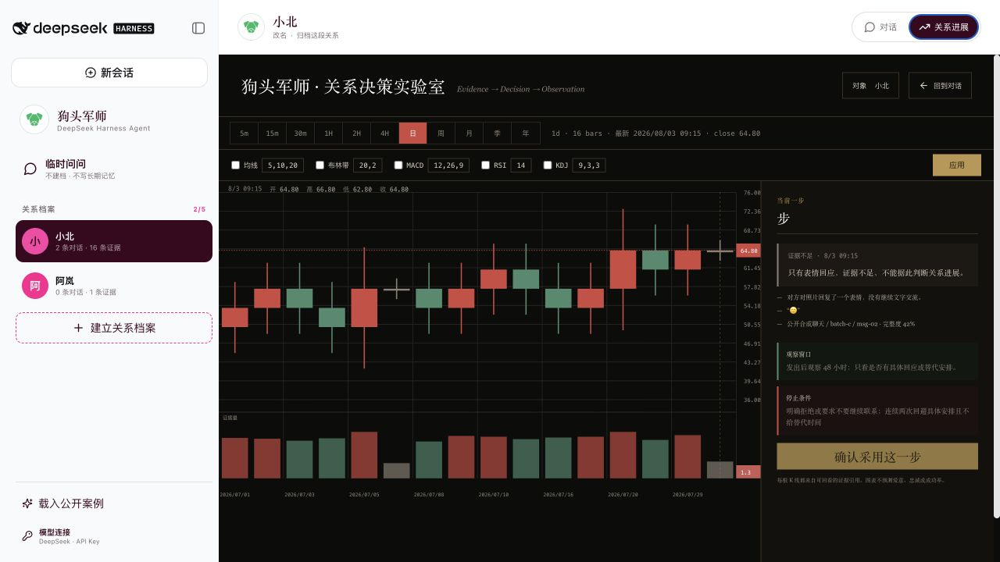

# 狗头军师 × DeepSeek Harness（GOAI 参赛版）

> GOAI 2026「无界应用 / Boundless Agents」初赛作品：手机和电脑里的感情军师，帮用户理清关系、想好下一步。

这是一个可以直接运行的 GOAI 参赛项目。DeepSeek Harness 负责对话、模型、工具和页面；原来的“狗头军师” Skill 不做改动，遇到具体问题时才读取少量需要的资料。

它不是一个“长得像 DeepSeek”的普通网页，而是真的运行在 DeepSeek Harness 里。详细的接入方式留在架构文档中，主材料只讲用户能得到什么。



## 直接运行

要求：Node.js 22.19+、pnpm 10.15+、Python 3。

```bash
cd competition/deepseek-harness-goutoujunshi
pnpm install --frozen-lockfile
pnpm start
```

浏览器打开 `http://127.0.0.1:3186/`，点击“载入公开案例”。这个完整演示无需 API Key，也不需要任何真实聊天。要连接真实模型时，直接点击左下角“模型连接”；界面只保留 DeepSeek API Key、添加提供方和自定义提供方。

如需改端口：

```bash
PORT=3190 pnpm start
```

## 一条完整的验收路径

1. 先点“临时问问”：像普通 Agent 一样直接说，不建档、不写长期记忆，刷新后清空。
2. 点击“载入公开案例”，得到互相隔离的“小北”和“阿岚”两个稳定对象档案。
3. 在“小北”的对话中查看自然语言形式的情绪承接、事实/推测/未知、下一步话术、48 小时观察窗口和停止条件。
4. 点击“关系进展”，进入与旧版一致的股票终端：16 根证据 K 线、周期栏、指标栏、OHLC、价格轴、当前价线、成交量和右侧决策面板；悬停查看事实、来源与完整度。
5. 在对象名下选择“归档这段关系”，把不再关注的人移出列表；资料保留并可恢复。
6. 点击输入框左侧 `+`，按需粘贴证据或演示 sender ID 映射冲突停止。
7. 点击“模型连接”，确认精简弹窗中 DeepSeek API Key、添加提供方和自定义提供方仍完整可用。



## 功能边界

- 最多 5 个关系对象；稳定内部 ID 与可修改显示代号分离。
- “临时问问”是明确的无长期记忆入口；普通对话中只在确有持续对象时自然建议建档。
- 主界面是轻量的普通 Agent 对话，不强迫用户阅读结构化分析卡片。
- 不再关注的人可归档并恢复；归档不是删除。
- 原始聊天只属于本地证据层，不进入长期记忆；长期记忆只保存 `user`、`object`、`relationship`、`event`、`hypothesis` 五类精简记录。
- 旧事件按阶段压缩，近期保留细节；召回时只允许当前对象和当前问题相关内容。
- 身份优先使用 sender/member ID、账号和会话元数据；缺少元数据时要求用户确认锚点，冲突时停止。
- 关系 K 线采用股票终端的信息密度与交互：周期、OHLC、价格轴、十字线、成交量、指标控制和右侧证据决策面板。它只解释已经记录的证据；红色是正向进展，绿色是退缩/冲突/投入下降，灰色是证据不足，不预测爱意、忠诚、人格或成功率。
- 视觉沿用旧版绿色狗头 Logo 与 `#ff168f` 死亡芭比粉；官方 DeepSeek Logo、侧栏、会话和模型提供方能力不被替换，设置入口被收敛为单一“模型连接”。
- 支持按需粘贴、截图/文件、ChatLab 和用户明确授权的电脑只读入口；不解密数据库、不绕过权限、不后台监控、不自动发消息。

## 验证

```bash
pnpm run test:all
pnpm run check:readonly
```

`check:readonly` 会把受保护的既有 Skill 文件与当前仓库默认分支快照对比，防止比赛项目误改根 `SKILL.md`、`references/**`、既有 `agents/**` 和 `scripts/memory_store.py`。

## 项目结构

```text
competition/deepseek-harness-goutoujunshi/
├── packages/goutoujunshi-bundle/       # 官方 Harness profile 可组合 bundle
├── packages/goutoujunshi-plugin/       # host tools、提示、client slots、UI 与领域逻辑
├── scripts/                             # profile 初始化、启动、只读边界检查
├── tests/                               # 对象、身份、证据、记忆、路由测试
├── docs/                                # 架构、演示、安全、上游锁定与视觉 QA
└── artifacts/screenshots/               # 公开合成案例的浏览器 QA 证据
```

更多说明：

- [GOAI 初赛作品简介与提交信息](submission/GOAI_INITIAL_SUBMISSION.md)
- [GOAI 初赛方案 PPT/PDF](submission/)
- [架构与隔离设计](docs/ARCHITECTURE.md)
- [公开 Demo 脚本](docs/DEMO.md)
- [数据与安全边界](docs/DATA_AND_SAFETY.md)
- [上游版本锁定](docs/UPSTREAM.md)
- [浏览器与设计 QA](docs/DESIGN_QA.md)
- [第三方声明](THIRD_PARTY_NOTICES.md)
- [工程交付与审计文档](documentation/architecture.md)
