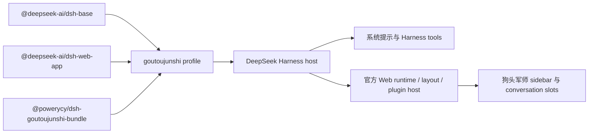
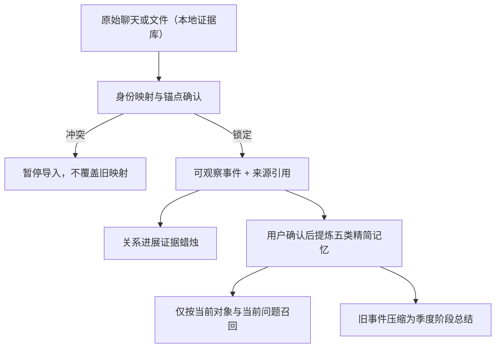

# 架构与隔离设计

## 真实 Harness 集成

启动脚本在项目私有 `.runtime/dsh-home` 下生成 `goutoujunshi` profile。profile 组合三个 bundle：

`@powerycy/dsh-goutoujunshi-plugin` 符合官方 client plugin 约定：包中声明 `dsh.client`、导出 `./client` 和 `./package.json`，由 Harness 的模块加载器载入。客户端把对象抽屉注册进官方 `sidebar.workspaces`，把主体验注册进 `conversation`，不覆盖官方 DeepSeek 侧栏、会话、模型提供方或插件系统。面向参赛体验，通用设置入口被隐藏，左下角“模型连接”直接打开官方模型页，并把弹窗收敛为模型提供方内容。

Host 侧注册三组模型可见工具：

- `goutoujunshi_route_references`：根据问题从既有只读 Skill 中加载 1–3 份参考。
- `goutoujunshi_identity_and_evidence`：锁定身份映射，发现冲突立即停止，并把可引用事件转换成证据蜡烛。
- `goutoujunshi_memory`：通过子进程适配既有只读 `scripts/memory_store.py`，不复制或修改原脚本。

## 只读 Skill 边界

比赛代码只存在于本目录。它可以读取根 `SKILL.md`、`references/**`，调用既有记忆脚本，但不编辑这些文件，也不编辑既有 `agents/**`。

`scripts/check-readonly.mjs` 会以 `origin/main` 为基线校验：

- `SKILL.md`
- `references/**`
- `agents/**`
- `scripts/memory_store.py`

参考路由器只接受固定白名单相对路径，并再次验证解析后的绝对路径仍在 Skill 根目录内。单次最多返回 3 份参考，每份只截取有限上下文，避免把完整素材库一次塞入提示词。

## 对象隔离模型

`object.id` 是所有关系数据的分区键，显示代号只是可编辑字段。每个对象独立拥有：

- `messages`：长期会话；
- `memories`：五类精简记忆；
- `evidence`：带来源引用的观察事件；
- `tasks`：由用户确认的后续动作；
- `identity.senders`：锁定的 sender/member ID 映射；
- `operations`：可撤销操作历史。

所有写入与召回都必须携带当前对象 ID。`recallForObject` 只允许当前对象和全局用户偏好两种 subject；记忆写入若 subject 与当前对象不一致会拒绝。对象总数由 host 配置与客户端同时限制为 5。

`temporary` 会话是单独的瞬时分区：它没有对象 ID，消息不进入 localStorage，也不调用长期记忆适配。页面刷新或 Harness 会话切换时清空。活动对象可被归档到独立列表；归档只改变可见状态，稳定 ID 及其会话、证据、记忆和任务保持不变，恢复后继续使用原 ID。

## 证据与记忆分层

K 线开高低收只是对事件证据方向与完整度的可视化编码，不是概率模型。低于完整度阈值的事件固定归类为“证据不足”。公开案例使用 16 条合成证据形成可复核的股票终端视图，并保留周期栏、指标栏、OHLC、价格轴、十字线、成交量和右侧证据决策面板；取消趋势预测线。

## 无 API Key 的公开演示

客户端内置完全合成的公开对象、消息、证据和精简记忆。UI 中的军师分析由同一套领域函数生成，因而可在未配置模型提供方时完整演示产品闭环。配置模型后，Harness Agent 可以进一步通过上述 host tools 按需调用只读 Skill。“模型连接”仍调用官方模型设置能力，支持 DeepSeek API Key、添加提供方与自定义提供方。
